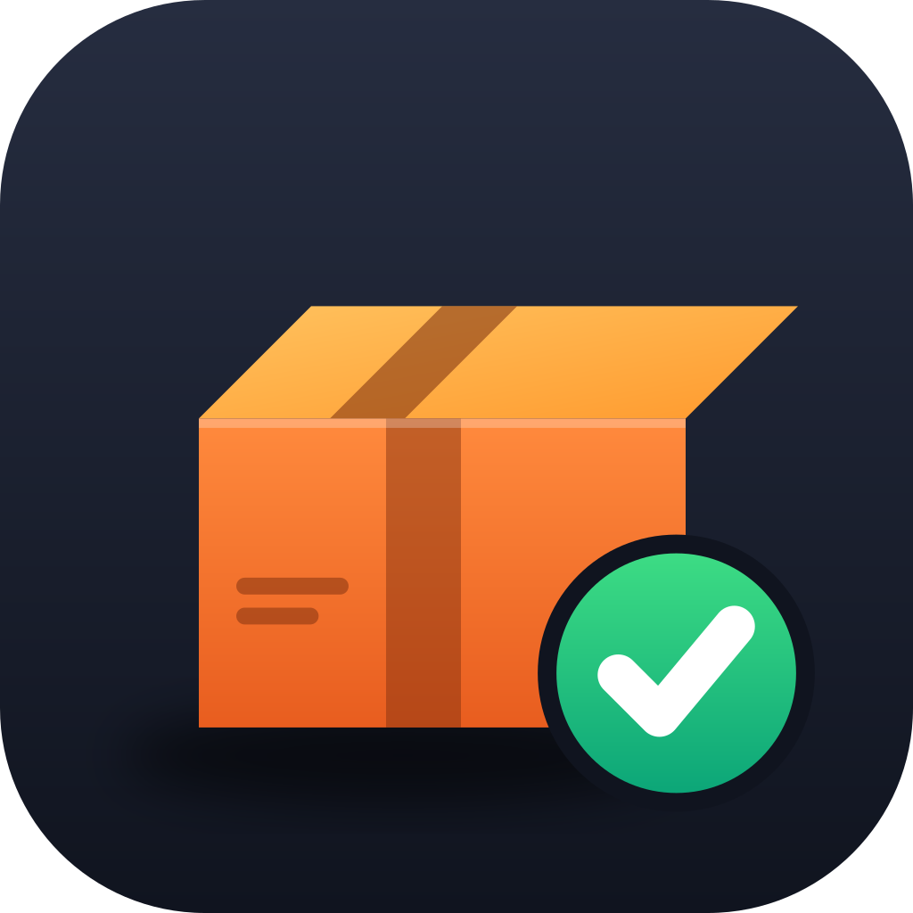

<p align="center">
  
</p>

<h1 align="center">DepotBar</h1>

<p align="center">
  <strong>Your Depot CI, one click away.</strong><br>
  A macOS menu bar app that shows your latest Depot workflows — no more keeping the dashboard open.
</p>

<p align="center">
  
  
  
  
</p>

---

## What it looks like

Click the menu bar icon, get the state of CI:

```
Depot CI
------------------------------
✓  Tests & Deploy — macch-core · 15m ago · 8m16s
✓  React Doctor — macch-core · #317 · 15m ago · 31s
⠋  Test Docker Build — macch-hub · #42 · 1m ago · 1m10s
✓  Run MFA Tests — macch-hub · 3m ago · 4m02s
✗  Nightly E2E — macch-hub · 2h ago · 22m45s
------------------------------
Updated just now
Refresh now                  ⌘R
Open Depot dashboard         ⌘D
Launch at Login              ✓
------------------------------
Quit DepotBar                ⌘Q
```

Click any workflow to open it on depot.dev. The menu bar icon itself tells the story at a glance:

| Icon | Meaning |
| ---- | ------- |
| animated spinner | a workflow is still running (or a refresh is taking >2s) |
| ✓ green check | everything finished clean |
| ✗ red cross | something failed |
| ⚠ triangle | couldn't reach Depot (see logs) |

## Features

- 📊 **Latest 5 workflows** with status, repo, PR number, age, and duration
- 🌀 **Live spinner** in the menu bar and on running rows
- 🔗 **One click** to open any workflow (or the whole dashboard) in your browser
- 🔄 **Auto-refresh** every 30 seconds, plus every time you open the menu
- 🚀 **Launch at login**, with a menu toggle
- 🔑 **Zero token setup** — reuses your Depot CLI login
- 🪶 **Native & tiny** — Swift + AppKit, no dependencies, no Electron

## Install

### Option A — Download (easiest)

1. Get `DepotBar.zip` from the [latest release](https://github.com/facmartoni/DepotBar/releases/latest).
2. Unzip and move `DepotBar.app` to `/Applications`.
3. First launch: right-click → **Open** (the app is ad-hoc signed, so Gatekeeper asks once), then confirm.

### Option B — Build from source

```sh
git clone https://github.com/facmartoni/DepotBar.git
cd DepotBar
./scripts/build-app.sh   # builds, installs to /Applications, launches
```

Requirements: macOS 14+, Xcode command line tools (`xcode-select --install`),
and the Depot CLI logged in:

```sh
brew install depot/tap/depot && depot login
```

## How auth works

DepotBar shells out to `depot ci workflow list -n 5 -o json` and reuses the
CLI's existing auth — there is no token to paste anywhere. The org for web
links is read from the CLI's own settings (`DEPOT_ORG_ID` overrides it).

## Configuration

| What | How |
| ---- | --- |
| Org for links | `DEPOT_ORG_ID` env var, else the CLI's current org |
| Logs | `/tmp/depotbar.log` |
| Debug the menu without UI | `/Applications/DepotBar.app/Contents/MacOS/DepotBar --dump-menu` |
| Verify menu-open timers | `/Applications/DepotBar.app/Contents/MacOS/DepotBar --self-test` |
| Refresh interval / row count | constants in [`main.swift`](Sources/DepotBar/main.swift) / [`DepotClient.swift`](Sources/DepotBar/DepotClient.swift) — edit & rebuild |

## Project layout

```
DepotBar/
├── Sources/DepotBar/
│   ├── main.swift            # menu bar app: status item, menu, timers
│   ├── DepotClient.swift     # Depot CLI wrapper + workflow models
│   └── MenuPresentation.swift# menu strings + --dump-menu debug mode
├── Resources/
│   ├── Info.plist            # LSUIElement (menu-bar-only) bundle config
│   └── AppIcon.icns
├── assets/                   # logo.svg, logo.png, AppIcon.iconset
└── scripts/build-app.sh      # release build → .app bundle → /Applications
```

## Uninstall

```sh
pkill -x DepotBar
rm -rf /Applications/DepotBar.app
```

(DepotBar also unregisters its login item when you toggle it off in the menu
before quitting.)

## FAQ

**The icon doesn't appear after install.**
DepotBar is menu-bar-only (no Dock icon). Look at the right side of the menu
bar for the ✓/✗ icon. If it's really missing, check `/tmp/depotbar.log`.

**It says the Depot CLI was not found.**
Install and log in: `brew install depot/tap/depot && depot login`, then
relaunch DepotBar.

**macOS says the app is from an unidentified developer.**
Right-click `DepotBar.app` → Open → Open. Only needed once (ad-hoc signature).

## Acknowledgments

Inspired by [DeployBar](https://deploybar.app) — same itch, but for
[Depot](https://depot.dev) CI. Not affiliated with Depot.

## License

[MIT](LICENSE) © 2026 Facundo García Martoni
